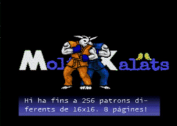

# RU66 V9968 demo example

This is a modified version of [Takayuki Hara's](https://github.com/hra1129) [DEVCON 14 V9968 demo](https://github.com/hra1129/TangCartMSX/tree/main/RTL/tangnano20k_vdp_cartridge_rev2_step1/src/th9958/devcon) that was shown on June 27th 2026 at the [AAMSX](https://www.aamsx.com) [RU66](https://www.aamsx.com/news/424) meeting in Barcelona (Spain).

The original demo by HRA! has been modified in the following way:
- it builds under [MSXgl](https://aoineko.org/msxgl/index.php?title=Main_Page)
- it runs continuously and features a carrousel of 10 different backgrounds which cycle sequentially
- the demo advances automatically after a certain time, without the need to press DOWN (you can still use DOWN to advance manually the demo)
- the demo is ended by pressing SPACE and returns to DOS instead of hanging

## Requirements

The demo requires a MSX2, MSX2+ or TurboR computer with a V9968 VDP cartridge, or a version of [OpenMSX](https://openmsx.org/) with [V9968 support](https://github.com/buppu3/openMSX).

This is a list of V9968 cartridges that are able to run the demo:
* HRA! [V9968 Development Cartridge](https://github.com/hra1129/V9968_Cartridge) flashed with [tangnano20k_vdp_cartridge.fs](https://github.com/hra1129/TangCartMSX/blob/2b6d7c37535a410957987c495cef1bd904741449/RTL/tangnano20k_vdp_cartridge_rev2_step1/impl/pnr/tangnano20k_vdp_cartridge.fs) from the original repository [^1]
* Modified [V9968 Development Cartridge](https://github.com/herraa1/v9968-cart-mod-v1) flashed with [tangnano20k_vdp_cartridge.fs](https://github.com/hra1129/TangCartMSX/blob/2b6d7c37535a410957987c495cef1bd904741449/RTL/tangnano20k_vdp_cartridge_rev2_step1/impl/pnr/tangnano20k_vdp_cartridge.fs) from the original repository [^1]
* [WonderTANG! 1.01c](https://github.com/lfantoniosi/WonderTANG#v101c-obsolete) with [tangnano20k_vdp_cartridge_wt101c.fs](https://github.com/herraa1/wonder9968/blob/port-wondertang-r2/RTL/tangnano20k_vdp_cartridge_rev2_step1/impl/pnr/tangnano20k_vdp_cartridge_wt101c.fs) from the [wonder9968](https://github.com/herraa1/wonder9968) project
* [WonderTANG! 1.02d](https://github.com/lfantoniosi/WonderTANG#v102d-previous) with [tangnano20k_vdp_cartridge_wt102d.fs](https://github.com/herraa1/wonder9968/blob/port-wondertang-r2/RTL/tangnano20k_vdp_cartridge_rev2_step1/impl/pnr/tangnano20k_vdp_cartridge_wt102d.fs) from the [wonder9968](https://github.com/herraa1/wonder9968) project
* [WonderTANG! 2.00b](https://github.com/lfantoniosi/WonderTANG#v20av20b-new) with [tangnano20k_vdp_cartridge_wt200b.fs](https://github.com/herraa1/wonder9968/blob/port-wondertang-r2/RTL/tangnano20k_vdp_cartridge_rev2_step1/impl/pnr/tangnano20k_vdp_cartridge_wt200b.fs) from the [wonder9968](https://github.com/herraa1/wonder9968) project

## How to run

### Using a DSK file

Boot the already built `emul/dsk/DOS2_RU66.dsk` if you are using OpenMSX with V9968 support, or a cartridge that supports the direct use of DSK files.

### Using DOS2/Nextor

Copy all the files under `emul/dos2` to your storage device of choice (floppy, WonderTANG!, FlashJacks, etc.) and run `RU66.COM`.

> [!NOTE]
> Do not copy `autoexec.bat`, `COMMAND2.COM` nor `MSXDOS2.SYS` if you don't need to boot from your media.

[^1]: The RTL used is slightly outdated as the demo was written to be run on all listed cartridges and the Wonder9968 RTL has not been updated with the latest V9968 breaking changes. If you run the demo with a recent RTL it will not show correctly the text boxes. That can be easily corrected by changing register 0x20 initialization from 0xff to 0x9f in reg_data[] in msx_vdp.c and rebuilding the demo.

